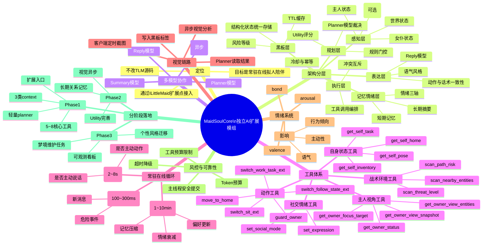

# MaidSoulCore AI 思维导图

```mermaid
mindmap
  root((MaidSoulCore\n独立AI扩展模组))
    定位
      不改TLM源码
      通过ILittleMaid扩展点接入
      目标是常驻在线拟人陪伴
    架构分层
      感知层
        主人状态
        女仆状态
        世界状态
        视觉输入(可选)
      黑板层
        结构化状态统一存储
        TTL缓存
        风险等级
      规划层
        规则门控
        Utility评分
        Planner模型裁决
      执行层
        工具调用编排
        冲突互斥
        冷却与幂等
      表达层
        Reply模型
        语气风格
        动作与话术一致性
      记忆情绪层
        短期记忆
        长期摘要
        情绪三轴
    多模型协作
      Planner模型
      Reply模型
      Vision模型(异步)
      Summary模型
    工具体系
      主人视角工具
        get_owner_status
        get_owner_focus_target
        get_owner_view_entities
        get_owner_view_snapshot
      自身状态工具
        get_self_pose
        get_self_task
        get_self_inventory
        get_self_home
      战术环境工具
        scan_nearby_entities
        scan_threat_level
        scan_path_risk
      动作工具
        switch_follow_state_ext
        switch_sit_ext
        switch_work_task_ext
        guard_owner
        move_to_home
      社交情绪工具
        set_social_mode
        set_expression
    常驻在线循环
      反应环(100~300ms)
        新消息
        危险事件
      主动环(2~8s)
        是否主动说话
        是否主动动作
      维护环(1~10min)
        记忆压缩
        情绪衰减
        偏好更新
    视觉链路
      客户端定时截图
      异步视觉分析
      写入黑板标签
      Planner读取结果
    情绪系统
      valence
      arousal
      bond
      影响
        主动性
        语气
        行为倾向
    风控与可靠性
      工具预算限制
      Token预算
      超时降级
      主线程安全提交
    分阶段落地
      Phase1
        扩展入口
        3类context
        5~8核心工具
        轻量planner
      Phase2
        视觉异步
        Utility完善
        长期关系记忆
      Phase3
        梦境维护任务
        个性风格迁移
        可观测看板
```
